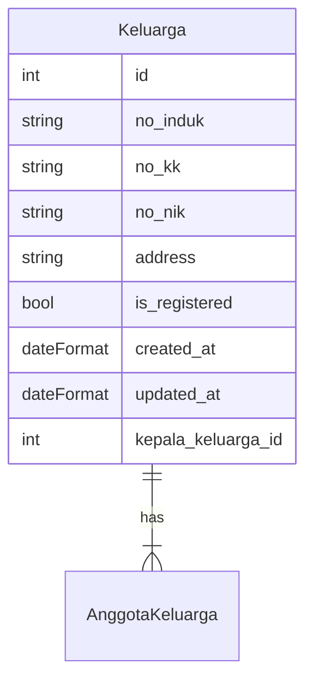
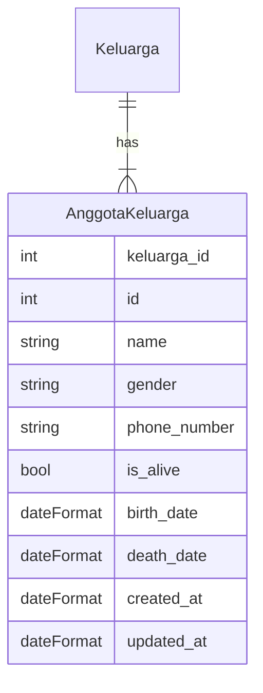

# Database Design

### Keluarga

```mermaid
erDiagram
    Keluarga ||--|{ AnggotaKeluarga : has

    Keluarga {
        int id

        string no_induk

        string no_kk
        string no_nik
        string address

        bool is_registered

        dateFormat created_at
        dateFormat updated_at

        int kepala_keluarga_id
    }
```

### Anggota Keluarga

```mermaid
erDiagram
    Keluarga ||--|{ AnggotaKeluarga : has

    AnggotaKeluarga {
        int keluarga_id

        int id

        string name
        string gender
        string phone_number

        bool is_alive
        dateFormat birth_date
        dateFormat death_date

        dateFormat created_at
        dateFormat updated_at
    }
```
