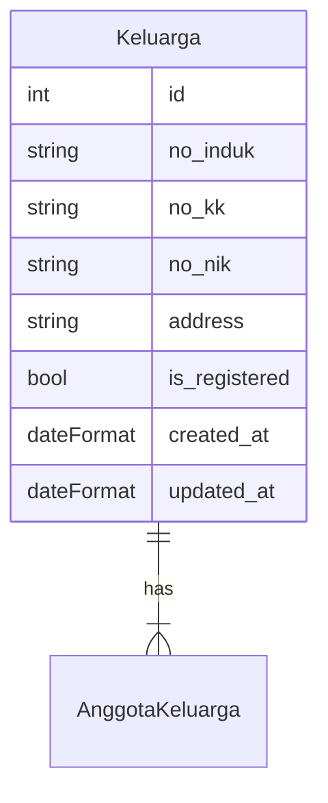
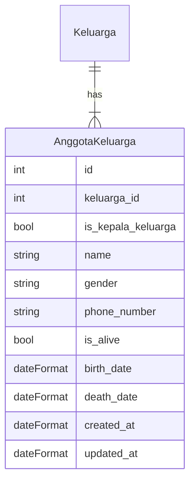

## Database Design

### Keluarga

### Anggota Keluarga

---

## API Design

### Keluarga

| No  | Endpoint                      | Method | Description                                              | Is Implemented |
| --- | ----------------------------- | ------ | -------------------------------------------------------- | -------------- |
| 1.  | `/keluarga`                   | GET    | Retrieve list keluarga (paginated)                       | No             |
| 2.  | `/keluarga`                   | POST   | Add a new keluarga                                       | No             |
| 3.  | `/keluarga/:no_induk`         | PATCH  | Update a keluarga                                        | No             |
| 4.  | `/keluarga/:no_induk`         | GET    | Retrieve a specific keluarga information                 | No             |
| 5.  | `/keluarga/:no_induk`         | DELETE | Remove a keluarga                                        | No             |
| 6.  | `/keluarga/:no_induk/anggota` | GET    | Retrive all anggota keluarga from this specific keluarga | No             |

### Anggota Keluarga

| No  | Endpoint                | Method | Description                                                | Is Implemented |
| --- | ----------------------- | ------ | ---------------------------------------------------------- | -------------- |
| 1.  | `/anggota-keluarga/:id` | GET    | Retrieve a specific information about the anggota keluarga | No             |
| 2.  | `/anggota-keluarga`     | POST   | Create a new anggota keluarga                              | No             |
| 3.  | `/anggota-keluarga/:id` | PATCH  | Update a specific anggota keluarga                         | No             |
| 4.  | `/anggota-keluarga/:id` | DELETE | Remove an anggota keluarga                                 | No             |
